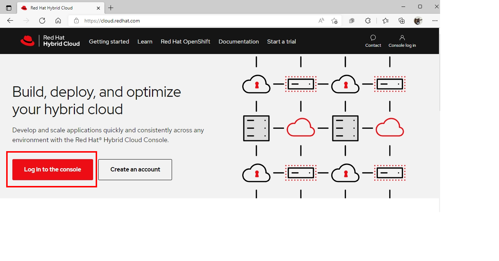
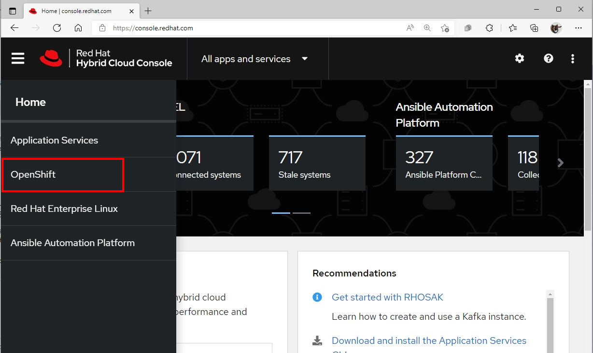
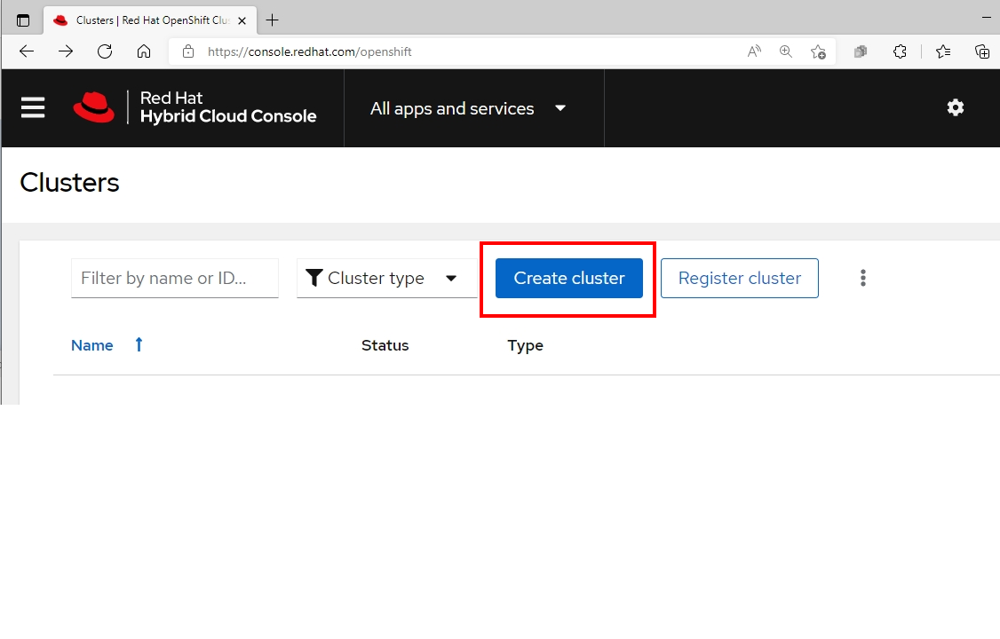
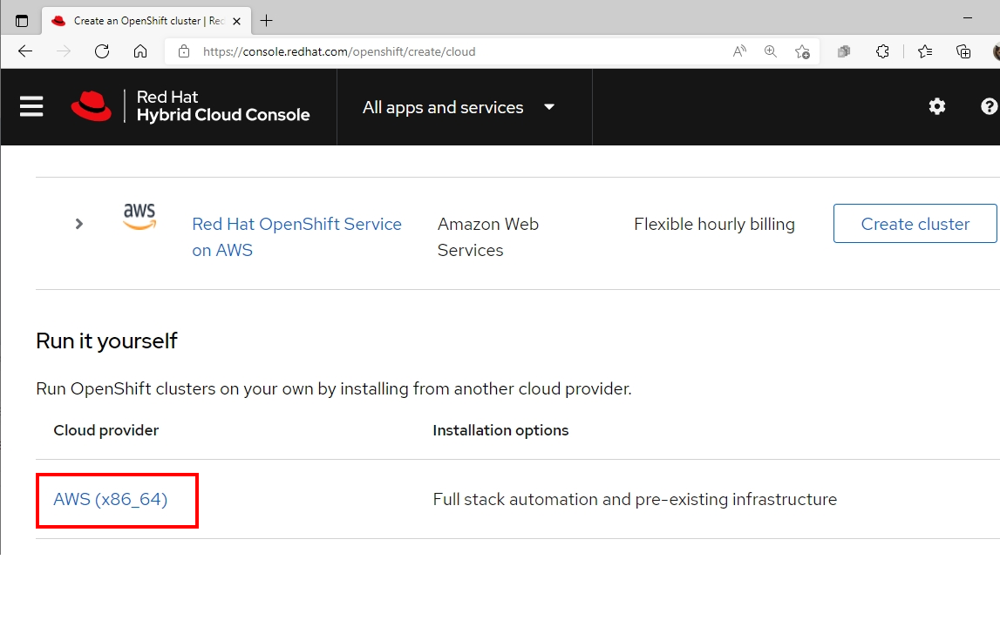
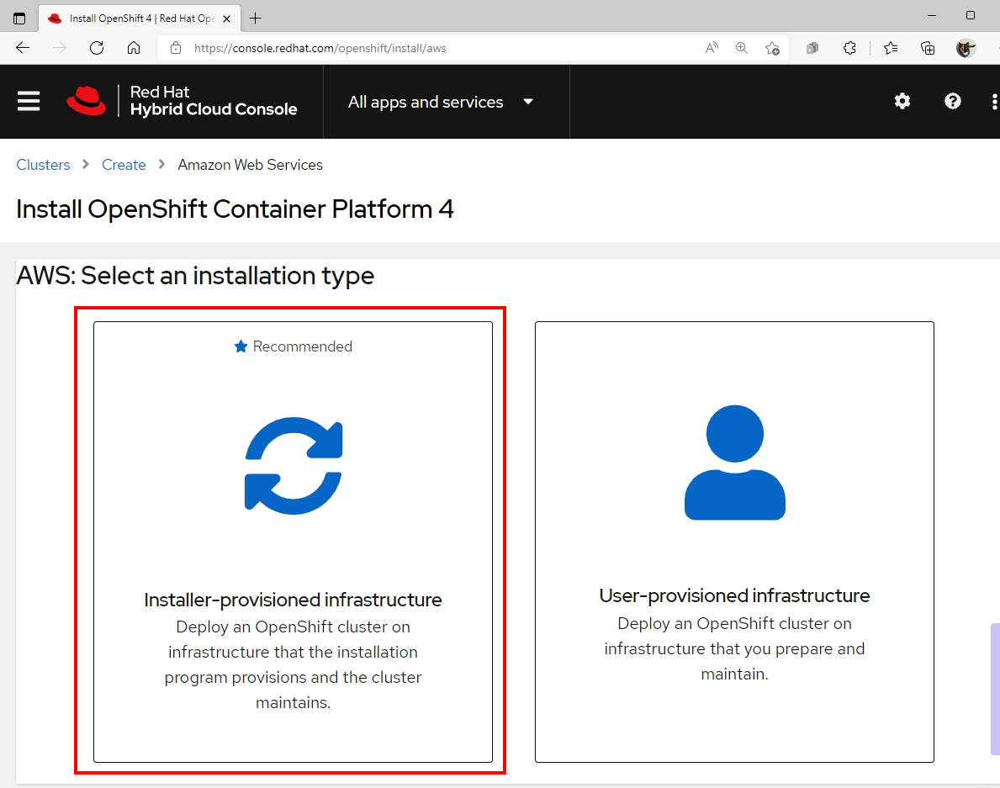
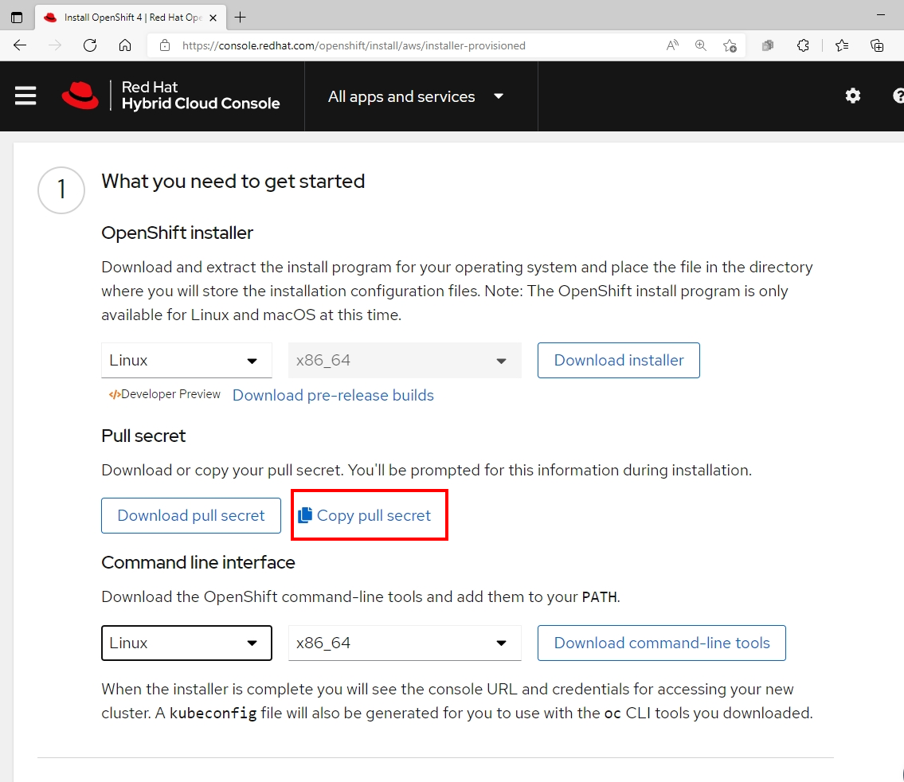
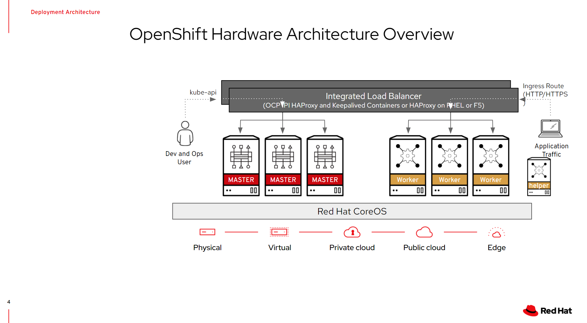

# **OpenShift Container Platform Installation on vSphere**
## **Prerequisite**
### **Need to prepare below information before deploy OpenShift Cluster**
1. Requires access to port 443 to vCenter and all ESXi hosts
2. Global Administrative privileges account of vCenter
3. 856 GB space on Storage
4. 2 IP Addresses for API and Ingress
5. DNS records for two static IP addresses (API and Ingress IP Address)
6. vCenter root CA  to trust installation host with vCenter before deploy OpenShift
7. Pull secret from https://cloud.redhat.com
8. Internet Access during installation process
9. Generating a Key Pair for cluster node with SSH Access
10. Download the OpenShift Command-line tools and Openshift installer  

### **Default CPU , MEM and Disk sizing for Openshift node after finish deployment**
| Node Type   | vCPU | Mem(GiB) | Storage (GB) | IOPs |
|-------------|:------:|:----------:|:--------------:|:------:|
| Master Node | 4    | 16       | 120          | 3000 |
| Worker Node | 2    | 8        | 120          | 3000 |
| Helper Node | 2    | 4        | 30           | 100  |


## **Set up Installation Prerequisites**

prepare the bastion server to install OpenShift Container Platform. This includes installing the AWS Command Line Interface , the OpenShift Installer , and the OpenShift CLI

1. Connect to your administration host
> **`ssh <user name>@bastion.<Domain Name>`**

2. Switch to ``root`` using the ``sudo`` command
> **`sudo -i`**


3. Get the `OpenShift-installer` binary:
>*# Download stable version of OpenShift installer*
>
> **`wget https://mirror.openshift.com/pub/openshift-v4/clients/ocp/stable-4.9/openshift-install-linux-4.9.23.tar.gz`**
>
>*# Extract file on /usr/bin directory*
>
>**`tar zxvf openshift-install-linux-4.9.23.tar.gz -C /usr/bin`**
>
>*# set execution permission by chmod command*
>
>**`chmod +x /usr/bin/openshift-install`**

4. Get the `oc` CLI Tool:
>*# Download stable version of OpenShift client*
>
> **`wget https://mirror.openshift.com/pub/openshift-v4/clients/ocp/stable-4.9/openshift-client-linux-4.9.23.tar.gz`**
>
>*# Extract file on /usr/bin directory*
>
>**`tar zxvf openshift-client-linux-4.9.23.tar.gz -C /usr/bin`**
>
>*# set execution permission by chmod command*
>
>**`chmod +x /usr/bin/oc`**

5. Check that the `Openshift-install` and `oc` CLI are in /usr/bin:
>**`ls -l /usr/bin/{oc,openshift-install}`**

## Sample Output
```
-rwxr-xr-x. 2 root root  74581752 Jan 30 16:35 /usr/bin/oc`*
-rwxr-xr-x. 1 root root 353038336 Jan 30 03:39 /usr/bin/openshift-install
```

6. Setup bash completion for the `Openshift-install` and `oc` CLI:
>**`openshift-install completion bash >/etc/bash_completion.d/openshift-install`**
>
>**`oc completion bash >/etc/bash_completion.d/openshift`**

7. Press **Ctrl+D** or type **exit** to log out of your root shell

8. Log in with your Red Hat Login for Copy **Pull Secret** at https://cloud.redhat.com and click to `Log in to the console` :   
| You need a Red Hat Subscription or Developer Account to access the Openshift page  
  


9. Click to the OpenShift Menu  

  
<br >
10. Click to Create Cluster Button

  
11. Click to `AWS (X86)` on **Run it yourself** section



12. Click **Installer-provisioned-infrastructure**

  
<br >
13. Find the Section **Pull Secret,** click `Copy Pull Secret` to place the secret in your clipboard, and then save it to a file



<br>
- You paste the pull secret into the prompt of the installer later.

```
{"auths":{"cloud.openshift.com":{"auth":"b3BlbnNoaWZ0LXJlbGVhc2UtZGV2K29jbV9hY2Nlc3NfNmJjMzI0YWU5NGJkNDY3ZmI0ZWMyMGZlM2Q4M2QwMmU6SE42MFJPVEE0R1hDUDdTVjA2RlZWSDdVMkpKSEpDWkxZSEtDOU1ISlBBNTdPR0tRVkpKV0FYS0w3UzhaT0g4Nw==","email":"youremail@redhat.com"},"quay.io":{"auth":"b3BlbnNoaWZ0LXJlbGVhc2UtZGV2K29jbV9hY2Nlc3NfNmJjMzI0YWU5NGJkNDY3ZmI0ZWMyMGZlM2Q4M2QwMmU6SE42MFJPVEE0R1hDUDdTVjA2RlZWSDdVMkpKSEpDWkxZSEtDOU1ISlBBNTdPR0tRVkpKV0FYS0w3UzhaT0g4Nw==","email":"youremail@redhat.com"},"registry.connect.redhat.com":{"auth":"fHVoYy1wb29sLTk1ZTEyMmI3LTE4NDgtNDhkZi1iYTlhLTc3YmI5NTdhNGI5NjpleUpoYkdjaU9pSlNVelV4TWlKOS5leUp6ZFdJaU9pSTRaVGd5TkRJd05UazFOREkwTTJJM09UUTRNR00wWXpOaE1EbGhZalU0WlNKOS5mYm4yenVvck9KcDB0R3ZtVmZqdFliaWdlS0w5OHJVN1NTem1SYlBwZzBKaVdQUDBnSWYtUmhIX19sOE5GQ3VjRzU3SkNNcmJhaVBqRU05alRaS0RtdXFqdVI1UjhhQmVKNmw2bjA0czlNUWhMS01YNFRpdDg5ejV0YXpuTDRuOFRqX1I4b20xLW02cUg3RE1Ia2QzNk80UmZReTdQaWdBbzBFalU3T3pGZEtweEVqZW8xNTY2MmRQOWdJUm1RSTJVTUl6Zm85Sl9BS0FjR2s4dVIxZ2hnc3JoTGxHS1NXdlNQb2RUQVlMNGY5WEczOU9Sa2tpVWVhWmtjWGdaTTlZQ29KMzZ5dWNjeW8tVjJDT1JCYjZxRDhiMlNZakNfWHlBNVpGRGZNRUVkS2JDVWNZczBsNXcySkpJTkVacUhVSzdYNDh2dEVsaGRFd3JaakJsRjB2b29KMG5WU0k0OWJsU3YwVkhwQm5acVpoVFh4ejA5TGZYZWNpVnF5TS13aEhWNldCNmZLRTVFMFVjckZkaFlxYlFqOW1USFFtb0hQVDhUUndWUkNBQ3NjVFVKYmFNVzRzRGctRkxoWXdxM09qZG1iZE1oOGNFS0NKR05SOVJBWVZPci12MVc0amJicnhTYjNTaEtBTld4ZXBxQlNEaFNkWjVIV25FYzZ4bFhWYk9rVl9ueXIxcl9Zd1FGV0FuZjc5X1RXTFhCNlJ5VTFxWlpULWVUazhGZjEyTTF6d0lQSDlVN0llY1lHeWN5YXZ4NkJ6MVljOWlHcFRQOFZIeGpQQUx5S0dzSWRpZEpaX0Jxdk5jUFMybC1hWE14WnJSbU9YNkNuak9pNnlJcUZWN2czYW1OMXpqSTZBZFdBX3p5OUlsMmdkMHk4S2g3SHJMQW9KQTNUbTZQSQ==","email":"youremail@redhat.com"},"registry.redhat.io":{"auth":"fHVoYy1wb29sLTk1ZTEyMmI3LTE4NDgtNDhkZi1iYTlhLTc3YmI5NTdhNGI5NjpleUpoYkdjaU9pSlNVelV4TWlKOS5leUp6ZFdJaU9pSTRaVGd5TkRJd05UazFOREkwTTJJM09UUTRNR00wWXpOaE1EbGhZalU0WlNKOS5mYm4yenVvck9KcDB0R3ZtVmZqdFliaWdlS0w5OHJVN1NTem1SYlBwZzBKaVdQUDBnSWYtUmhIX19sOE5GQ3VjRzU3SkNNcmJhaVBqRU05alRaS0RtdXFqdVI1UjhhQmVKNmw2bjA0czlNUWhMS01YNFRpdDg5ejV0YXpuTDRuOFRqX1I4b20xLW02cUg3RE1Ia2QzNk80UmZReTdQaWdBbzBFalU3T3pGZEtweEVqZW8xNTY2MmRQOWdJUm1RSTJVTUl6Zm85Sl9BS0FjR2s4dVIxZ2hnc3JoTGxHS1NXdlNQb2RUQVlMNGY5WEczOU9Sa2tpVWVhWmtjWGdaTTlZQ29KMzZ5dWNjeW8tVjJDT1JCYjZxRDhiMlNZakNfWHlBNVpGRGZNRUVkS2JDVWNZczBsNXcySkpJTkVacUhVSzdYNDh2dEVsaGRFd3JaakJsRjB2b29KMG5WU0k0OWJsU3YwVkhwQm5acVpoVFh4ejA5TGZYZWNpVnF5TS13aEhWNldCNmZLRTVFMFVjckZkaFlxYlFqOW1USFFtb0hQVDhUUndWUkNBQ3NjVFVKYmFNVzRzRGctRkxoWXdxM09qZG1iZE1oOGNFS0NKR05SOVJBWVZPci12MVc0amJicnhTYjNTaEtBTld4ZXBxQlNEaFNkWjVIV25FYzZ4bFhWYk9rVl9ueXIxcl9Zd1FGV0FuZjc5X1RXTFhCNlJ5VTFxWlpULWVUazhGZjEyTTF6d0lQSDlVN0llY1lHeWN5YXZ4NkJ6MVljOWlHcFRQOFZIeGpQQUx5S0dzSWRpZEpaX0Jxdk5jUFMybC1hWE14WnJSbU9YNkNuak9pNnlJcUZWN2czYW1OMXpqSTZBZFdBX3p5OUlsMmdkMHk4S2g3SHJMQW9KQTNUbTZQSQ==","email":"youremail@redhat.com"}}}
```

14. Double check that your pull secret contains credentials for all three container registries: **quay.io , registry.connect.redhat.com,** and **registry.redhat.io** as well **cloud.openshift.com.**  

15. Create an SSH keypair to be used for your Openshift environement:
>**`ssh-keygen -f ~/.ssh/cluster-{Name}-key -N '' `**  

<br >
<br >
<br >

---

## **<p style="color:Blue">Install Openshift Container Platform</p>**

16. Run the `Openshift-installer` and answer the prompts
>**`openshift-install create cluster --dir <installation_directory> `**  


```
? SSH Public Key /home/<user_name>/.ssh/cluster-{Name}-key.pub
? Platform vsphere
? vCenter <vCenter's IP address>
? Username <Administrator Privileges account of vCenter>
? Password <Password of Administrator account>
INFO Connecting to vCenter <vCenter's IP address>
? Datacenter <Data Center name for deploy OpenShift cluster>
? Default Datastore <Data Store for deploy OpenShift Cluster>
? Network <Network vlan id that same vlan with API and Ingress IP address>
? Virtual IP Address for API <API static IP Address>
? Virtual IP Address for Ingress <Ingress static IP Address>
? Base Domain <FQDN for OpenShift Cluster>
? Cluster Name <your OpenShift Cluster Name>
? Pull Secret [? for help] 
***************************************************************************************************************************************************************

``` 

## Sample Output

``` 
INFO Creating infrastructure resources...
INFO Waiting up to 20m0s for the Kubernetes API at https://api.cluster-e9eb.sandbox1409.opentlc.com:6443...
INFO API v1.19.0+e49167a up
INFO Waiting up to 30m0s for bootstrapping to complete...
INFO Destroying the bootstrap resources...
INFO Waiting up to 40m0s for the cluster at https://api.cluster-e9eb.sandbox1409.opentlc.com:6443 to initialize...
INFO Waiting up to 10m0s for the openshift-console route to be created...
INFO Install complete!
INFO To access the cluster as the system:admin user when using 'oc', run 'export KUBECONFIG=/home/wkulhane-redhat.com/cluster-e9eb/auth/kubeconfig'
INFO Access the OpenShift web-console here: https://console-openshift-console.apps.cluster-e9eb.sandbox1409.opentlc.com
INFO Login to the console with user: kubeadmin, password: IbN6W-j3J6I-wLWUq-h6r8o
INFO Time elapsed: 32m6s

``` 


> **Note:** the following items from the output of the install command  
- The location of the **kubeconfig** file, which is required for setting the KUBECONFIG environment variable and, as suggested, sets the Openshfit user ID to **system:admin**.
- the **kubeadmin** user ID and associated password (**GEveR-tBVTB-jJUJB-iC9Jn** in the example).  
    - the password for the **kubeadmin** user is also written into the **auth/kubeadmin-password** file.
- The URL of the webconsole (**https://console-openshift-console.apps.cluster-<GUID>.sandboxNNNN.opentlc.com** in the example) and the credentials(again) to log into the web console.
<br>
<br>

## **<p style="color:Blue">Validate Cluster</p>**
17. set up the CLI

>`export KUBECONFIG=$HOME/cluster-{NAME}/auth/kubeconfig`
>`echo "export KUBECONFIG=$HOME/cluster-{NAME}/auth/kubeconfig" >>$HOME/.bashrc`  
- This makes youi **system:admin** on the cluster.

18. Validate that you are in fact the cluster administrator
>`oc whoami`

```
system:admin
```

19. Validate that all nodes have a status of **Ready**:
>`oc get nodes`

```
NAME                    STATUS   ROLES    AGE   VERSION
vm-testvm-master-0       Ready    master   24m   v1.19.0+e49167a
vm-testvm-worker-4dtqf   Ready    worker   17m   v1.19.0+e49167a
vm-testvm-worker-lr8ll   Ready    worker   19m   v1.19.0+e49167a
vm-testvm-master-1       Ready    master   24m   v1.19.0+e49167a
vm-testvm-worker-t2j5v   Ready    worker   19m   v1.19.0+e49167a
vm-testvm-master-2       Ready    master   24m   v1.19.0+e49167a

```

20. Validate that all of the pods are running, and that none of them is in **Error** or **CrashLoopBackoff** states:

>`oc get pod -A`

```
NAMESPACE                                NAME                                            READY   STATUS      RESTARTS   AGE
openshift-apiserver-operator             openshift-apiserver-operator-7f87667d89-hfstg   1/1     Running     1          23m
openshift-apiserver                      apiserver-5d6dbc5bf6-4nkjn                      1/1     Running     0          12m
openshift-apiserver                      apiserver-5d6dbc5bf6-4v47v                      1/1     Running     0          11m
openshift-apiserver                      apiserver-5d6dbc5bf6-cphk2                      1/1     Running     0          11m
openshift-authentication-operator        authentication-operator-559d87b6-9j86h          1/1     Running     1          22m
openshift-authentication                 oauth-openshift-5947c7bdbc-8t54v                1/1     Running     0          11m
openshift-authentication                 oauth-openshift-5947c7bdbc-9kt5d                1/1     Running     0          11m
openshift-cloud-credential-operator      cloud-credential-operator-58d66f676f-pg8nf      1/1     Running     1          23m
openshift-cluster-machine-approver       machine-approver-68cd7c876d-7hr5x               2/2     Running     0          22m

[...]

openshift-sdn                            sdn-npstq                                       2/2     Running     0          19m
openshift-service-ca-operator            service-ca-operator-84d747f74-5blzw             1/1     Running     1          29m
openshift-service-ca                     service-ca-f766bdf44-tss7t                      1/1     Running     0          23m

```
## **OpenShift Architecture**



