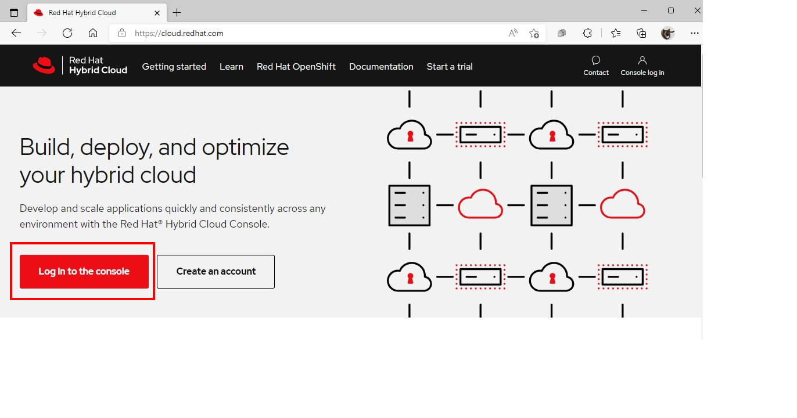
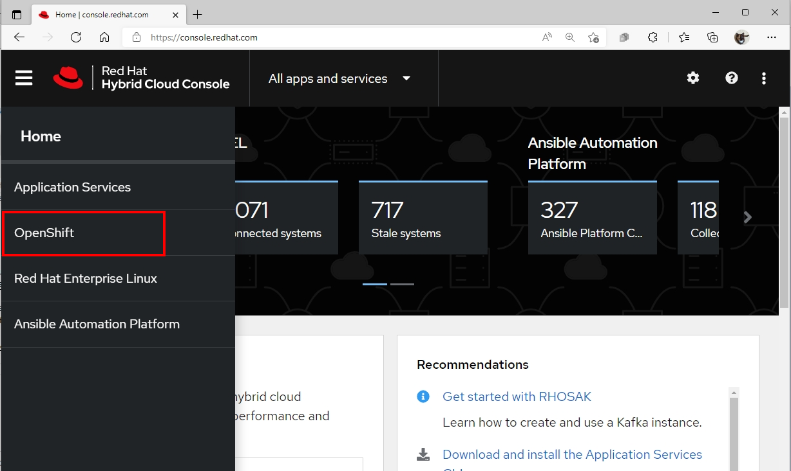
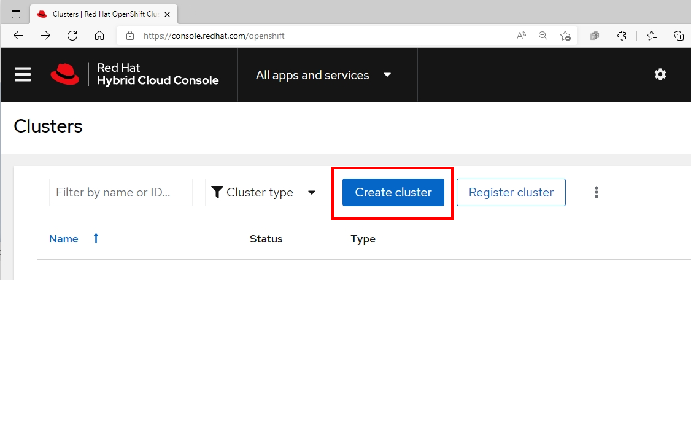
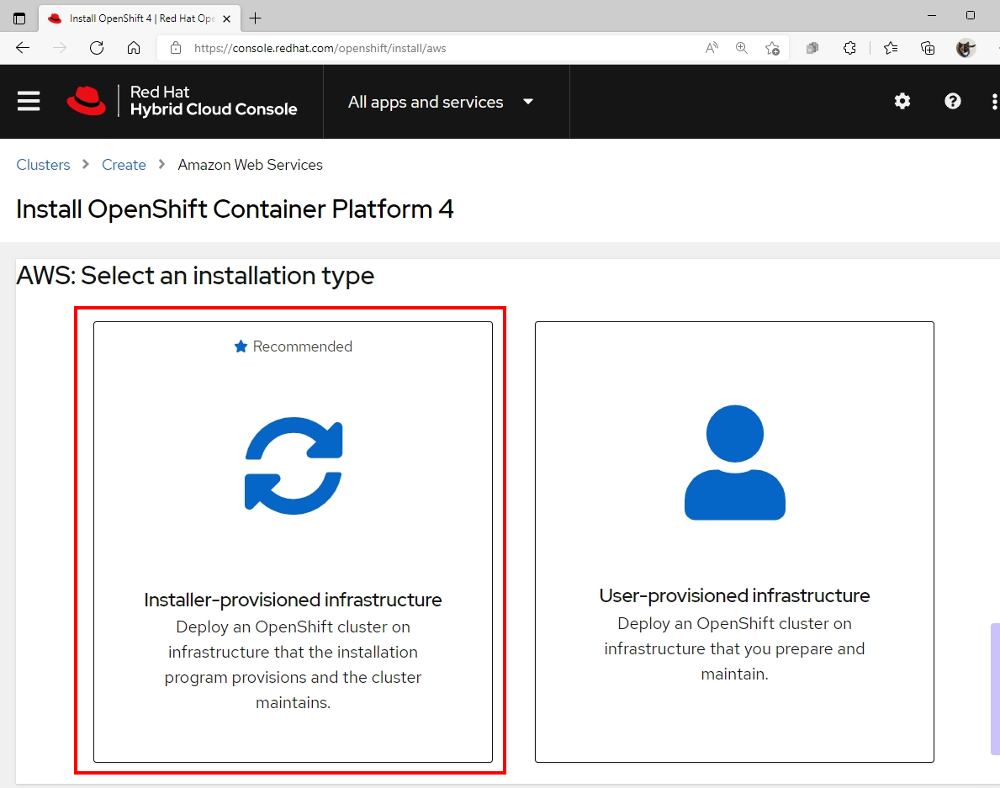
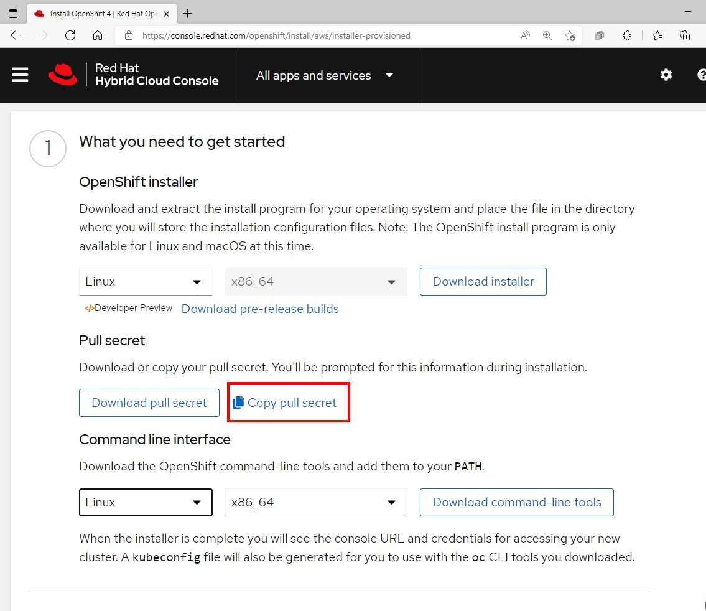

# **OpenShift Container Platform Installation on AWS**

## **<p style="color:Blue">Set up Installation Prerequisites</p>**

prepare the bastion server to install OpenShift Container Platform. This includes installing the AWS Command Line Interface , the OpenShift Installer , and the OpenShift CLI

1. Connect to your administration host

> **`ssh <user name>@bastion.<Domain Name>`**

2. Switch to ``root`` using the ``sudo`` command
> **`sudo -i`**

3. Install the `aws` CLI Tools:
>*# Download the lastest AWS Command Line Interface*
>
> **`curl "https:/s3.amazonaws.com/aws-cli/awscli-bundle.zip" -o "awscli-bundle.zip"`** 
>
>*#Unzip AWS CLI tool*
>
> **`unzip awscli-bundle.zip`**
>
>*# Install the AWS CLI into /bin/aws*
>
> **`./awscli-bundle/install -i /usr/local/aws -b /bin/aws`**
>
>*# Validate the the AWS CLI works*
>
> **`aws --version`**

4. Get the `OpenShift-installer` binary:
>*# Download stable version of OpenShift installer*
>
> **`wget https://mirror.openshift.com/pub/openshift-v4/clients/ocp/stable-4.9/openshift-install-linux-4.9.23.tar.gz`**
>
>*# Extract file on /usr/bin directory*
>
>**`tar zxvf openshift-install-linux-4.9.23.tar.gz -C /usr/bin`**
>
>*# set execution permission by chmod command*
>
>**`chmod +x /usr/bin/openshift-install`**

5. Get the `oc` CLI Tool:
>*# Download stable version of OpenShift client*
>
> **`wget https://mirror.openshift.com/pub/openshift-v4/clients/ocp/stable-4.9/openshift-client-linux-4.9.23.tar.gz`**
>
>*# Extract file on /usr/bin directory*
>
>**`tar zxvf openshift-client-linux-4.9.23.tar.gz -C /usr/bin`**
>
>*# set execution permission by chmod command*
>
>**`chmod +x /usr/bin/oc`**

6. Check that the `Openshift-install` and `oc` CLI are in /usr/bin:
>**`ls -l /usr/bin/{oc,openshift-install}`**

## Sample Output
```
-rwxr-xr-x. 2 root root  74581752 Jan 30 16:35 /usr/bin/oc`*
-rwxr-xr-x. 1 root root 353038336 Jan 30 03:39 /usr/bin/openshift-install
```

7. Setup bash completion for the `Openshift-install` and `oc` CLI:
>**`openshift-install completion bash >/etc/bash_completion.d/openshift-install`**
>
>**`oc completion bash >/etc/bash_completion.d/openshift`**

8. Press **Ctrl+D** or type **exit** to log out of your root shell

9. Save your provided AWS credentials to the **$HOME/.aws/credentials** file, making sure to replace **YOURACCESSKEY** and **YOURSECRETACCESSKEY** with your individual credentials:

> **`mkdir $HOME/.aws`**
>
> **`cat << EOF >> $HOME/.aws/credentials`**  
> **`[default]`**  
> **`access_key_id= {AWSKEY}`**  
> **`aws_secret_access_key = {AWSSECRETKEY}`**  
> **`region = {REGION}`**  
> **`EOF`**  

10. Check to see that your credentials work:

> **`aws sts get-caller-identity`**
## Sample Output

```
{
    "UserId": "AIDAXPZEZ6JLW2LZX2ZBT",
    "Account": "514936402519",
    "Arn": "arn:aws:iam::514936402519:user/wkulhane@redhat.com-e9eb"
}

```

11. Log in with your Red Hat Login for Copy **Pull Secret** at https://cloud.redhat.com and click to `Log in to the console` :   
| You need a Red Hat Subscription or Developer Account to access the Openshift page  
  


12. Click to the OpenShift Menu  

  
<br >
13. Click to Create Cluster Button

  
14. Click to `AWS (X86)` on **Run it yourself** section


15. Click **Installer-provisioned-infrastructure**

  
<br >
16. Find the Section **Pull Secret,** click `Copy Pull Secret` to place the secret in your clipboard, and then save it to a file



<br>
- You paste the pull secret into the prompt of the installer later.

```
{"auths":{"cloud.openshift.com":{"auth":"b3BlbnNoaWZ0LXJlbGVhc2UtZGV2K29jbV9hY2Nlc3NfNmJjMzI0YWU5NGJkNDY3ZmI0ZWMyMGZlM2Q4M2QwMmU6SE42MFJPVEE0R1hDUDdTVjA2RlZWSDdVMkpKSEpDWkxZSEtDOU1ISlBBNTdPR0tRVkpKV0FYS0w3UzhaT0g4Nw==","email":"youremail@redhat.com"},"quay.io":{"auth":"b3BlbnNoaWZ0LXJlbGVhc2UtZGV2K29jbV9hY2Nlc3NfNmJjMzI0YWU5NGJkNDY3ZmI0ZWMyMGZlM2Q4M2QwMmU6SE42MFJPVEE0R1hDUDdTVjA2RlZWSDdVMkpKSEpDWkxZSEtDOU1ISlBBNTdPR0tRVkpKV0FYS0w3UzhaT0g4Nw==","email":"youremail@redhat.com"},"registry.connect.redhat.com":{"auth":"fHVoYy1wb29sLTk1ZTEyMmI3LTE4NDgtNDhkZi1iYTlhLTc3YmI5NTdhNGI5NjpleUpoYkdjaU9pSlNVelV4TWlKOS5leUp6ZFdJaU9pSTRaVGd5TkRJd05UazFOREkwTTJJM09UUTRNR00wWXpOaE1EbGhZalU0WlNKOS5mYm4yenVvck9KcDB0R3ZtVmZqdFliaWdlS0w5OHJVN1NTem1SYlBwZzBKaVdQUDBnSWYtUmhIX19sOE5GQ3VjRzU3SkNNcmJhaVBqRU05alRaS0RtdXFqdVI1UjhhQmVKNmw2bjA0czlNUWhMS01YNFRpdDg5ejV0YXpuTDRuOFRqX1I4b20xLW02cUg3RE1Ia2QzNk80UmZReTdQaWdBbzBFalU3T3pGZEtweEVqZW8xNTY2MmRQOWdJUm1RSTJVTUl6Zm85Sl9BS0FjR2s4dVIxZ2hnc3JoTGxHS1NXdlNQb2RUQVlMNGY5WEczOU9Sa2tpVWVhWmtjWGdaTTlZQ29KMzZ5dWNjeW8tVjJDT1JCYjZxRDhiMlNZakNfWHlBNVpGRGZNRUVkS2JDVWNZczBsNXcySkpJTkVacUhVSzdYNDh2dEVsaGRFd3JaakJsRjB2b29KMG5WU0k0OWJsU3YwVkhwQm5acVpoVFh4ejA5TGZYZWNpVnF5TS13aEhWNldCNmZLRTVFMFVjckZkaFlxYlFqOW1USFFtb0hQVDhUUndWUkNBQ3NjVFVKYmFNVzRzRGctRkxoWXdxM09qZG1iZE1oOGNFS0NKR05SOVJBWVZPci12MVc0amJicnhTYjNTaEtBTld4ZXBxQlNEaFNkWjVIV25FYzZ4bFhWYk9rVl9ueXIxcl9Zd1FGV0FuZjc5X1RXTFhCNlJ5VTFxWlpULWVUazhGZjEyTTF6d0lQSDlVN0llY1lHeWN5YXZ4NkJ6MVljOWlHcFRQOFZIeGpQQUx5S0dzSWRpZEpaX0Jxdk5jUFMybC1hWE14WnJSbU9YNkNuak9pNnlJcUZWN2czYW1OMXpqSTZBZFdBX3p5OUlsMmdkMHk4S2g3SHJMQW9KQTNUbTZQSQ==","email":"youremail@redhat.com"},"registry.redhat.io":{"auth":"fHVoYy1wb29sLTk1ZTEyMmI3LTE4NDgtNDhkZi1iYTlhLTc3YmI5NTdhNGI5NjpleUpoYkdjaU9pSlNVelV4TWlKOS5leUp6ZFdJaU9pSTRaVGd5TkRJd05UazFOREkwTTJJM09UUTRNR00wWXpOaE1EbGhZalU0WlNKOS5mYm4yenVvck9KcDB0R3ZtVmZqdFliaWdlS0w5OHJVN1NTem1SYlBwZzBKaVdQUDBnSWYtUmhIX19sOE5GQ3VjRzU3SkNNcmJhaVBqRU05alRaS0RtdXFqdVI1UjhhQmVKNmw2bjA0czlNUWhMS01YNFRpdDg5ejV0YXpuTDRuOFRqX1I4b20xLW02cUg3RE1Ia2QzNk80UmZReTdQaWdBbzBFalU3T3pGZEtweEVqZW8xNTY2MmRQOWdJUm1RSTJVTUl6Zm85Sl9BS0FjR2s4dVIxZ2hnc3JoTGxHS1NXdlNQb2RUQVlMNGY5WEczOU9Sa2tpVWVhWmtjWGdaTTlZQ29KMzZ5dWNjeW8tVjJDT1JCYjZxRDhiMlNZakNfWHlBNVpGRGZNRUVkS2JDVWNZczBsNXcySkpJTkVacUhVSzdYNDh2dEVsaGRFd3JaakJsRjB2b29KMG5WU0k0OWJsU3YwVkhwQm5acVpoVFh4ejA5TGZYZWNpVnF5TS13aEhWNldCNmZLRTVFMFVjckZkaFlxYlFqOW1USFFtb0hQVDhUUndWUkNBQ3NjVFVKYmFNVzRzRGctRkxoWXdxM09qZG1iZE1oOGNFS0NKR05SOVJBWVZPci12MVc0amJicnhTYjNTaEtBTld4ZXBxQlNEaFNkWjVIV25FYzZ4bFhWYk9rVl9ueXIxcl9Zd1FGV0FuZjc5X1RXTFhCNlJ5VTFxWlpULWVUazhGZjEyTTF6d0lQSDlVN0llY1lHeWN5YXZ4NkJ6MVljOWlHcFRQOFZIeGpQQUx5S0dzSWRpZEpaX0Jxdk5jUFMybC1hWE14WnJSbU9YNkNuak9pNnlJcUZWN2czYW1OMXpqSTZBZFdBX3p5OUlsMmdkMHk4S2g3SHJMQW9KQTNUbTZQSQ==","email":"youremail@redhat.com"}}}
```

17. Double check that your pull secret contains credentials for all three container registries: **quay.io , registry.connect.redhat.com,** and **registry.redhat.io** as well **cloud.openshift.com.**  

18. Create an SSH keypair to be used for your Openshift environement:
>**`ssh-keygen -f ~/.ssh/cluster-{Name}-key -N '' `**  

<br >
<br >
<br >

---

## **<p style="color:Blue">Install Openshift Container Platform</p>**

19. Run the `Openshift-installer` and answer the prompts
>**`openshift-install create cluster --dir <installation_directory> `**  


```
? SSH Public Key /home/<user_name>/.ssh/cluster-{Name}-key.pub
? Platform aws
INFO Credentials loaded from the "default" profile in file "/home/<user_name>/.aws/credentials"
? Region <your AWS Region>
? Base Domain <your AWS Domain>
? Cluster Name <your AWS Cluster Name>
? Pull Secret [? for help] 
***************************************************************************************************************************************************************

``` 

## Sample Output

``` 
INFO Creating infrastructure resources...
INFO Waiting up to 20m0s for the Kubernetes API at https://api.cluster-e9eb.sandbox1409.opentlc.com:6443...
INFO API v1.19.0+e49167a up
INFO Waiting up to 30m0s for bootstrapping to complete...
INFO Destroying the bootstrap resources...
INFO Waiting up to 40m0s for the cluster at https://api.cluster-e9eb.sandbox1409.opentlc.com:6443 to initialize...
INFO Waiting up to 10m0s for the openshift-console route to be created...
INFO Install complete!
INFO To access the cluster as the system:admin user when using 'oc', run 'export KUBECONFIG=/home/wkulhane-redhat.com/cluster-e9eb/auth/kubeconfig'
INFO Access the OpenShift web-console here: https://console-openshift-console.apps.cluster-e9eb.sandbox1409.opentlc.com
INFO Login to the console with user: kubeadmin, password: IbN6W-j3J6I-wLWUq-h6r8o
INFO Time elapsed: 32m6s

``` 


> **Note:** the following items from the output of the install command  
- The location of the **kubeconfig** file, which is required for setting the KUBECONFIG environment variable and, as suggested, sets the Openshfit user ID to **system:admin**.
- the **kubeadmin** user ID and associated password (**GEveR-tBVTB-jJUJB-iC9Jn** in the example).  
    - the password for the **kubeadmin** user is also written into the **auth/kubeadmin-password** file.
- The URL of the webconsole (**https://console-openshift-console.apps.cluster-<GUID>.sandboxNNNN.opentlc.com** in the example) and the credentials(again) to log into the web console.
<br>
<br>

## **<p style="color:Blue">Validate Cluster</p>**
20. set up the CLI

>`export KUBECONFIG=$HOME/cluster-{NAME}/auth/kubeconfig`
>`echo "export KUBECONFIG=$HOME/cluster-{NAME}/auth/kubeconfig" >>$HOME/.bashrc`  
- This makes youi **system:admin** on the cluster.

21. Validate that you are in fact the cluster administrator
>`oc whoami`

```
system:admin
```

22. Validate that all nodes have a status of **Ready**:
>`oc get nodes`

```
NAME                                         STATUS   ROLES    AGE   VERSION
ip-10-0-132-239.us-east-2.compute.internal   Ready    master   24m   v1.19.0+e49167a
ip-10-0-147-206.us-east-2.compute.internal   Ready    worker   17m   v1.19.0+e49167a
ip-10-0-169-195.us-east-2.compute.internal   Ready    worker   19m   v1.19.0+e49167a
ip-10-0-184-201.us-east-2.compute.internal   Ready    master   24m   v1.19.0+e49167a
ip-10-0-200-125.us-east-2.compute.internal   Ready    worker   19m   v1.19.0+e49167a
ip-10-0-212-189.us-east-2.compute.internal   Ready    master   24m   v1.19.0+e49167a

```

23. Validate that all of the pods are running, and that none of them is in **Error** or **CrashLoopBackoff** states:

>`oc get pod -A`

```
NAMESPACE                                NAME                                            READY   STATUS      RESTARTS   AGE
openshift-apiserver-operator             openshift-apiserver-operator-7f87667d89-hfstg   1/1     Running     1          23m
openshift-apiserver                      apiserver-5d6dbc5bf6-4nkjn                      1/1     Running     0          12m
openshift-apiserver                      apiserver-5d6dbc5bf6-4v47v                      1/1     Running     0          11m
openshift-apiserver                      apiserver-5d6dbc5bf6-cphk2                      1/1     Running     0          11m
openshift-authentication-operator        authentication-operator-559d87b6-9j86h          1/1     Running     1          22m
openshift-authentication                 oauth-openshift-5947c7bdbc-8t54v                1/1     Running     0          11m
openshift-authentication                 oauth-openshift-5947c7bdbc-9kt5d                1/1     Running     0          11m
openshift-cloud-credential-operator      cloud-credential-operator-58d66f676f-pg8nf      1/1     Running     1          23m
openshift-cluster-machine-approver       machine-approver-68cd7c876d-7hr5x               2/2     Running     0          22m

[...]

openshift-sdn                            sdn-npstq                                       2/2     Running     0          19m
openshift-service-ca-operator            service-ca-operator-84d747f74-5blzw             1/1     Running     1          29m
openshift-service-ca                     service-ca-f766bdf44-tss7t                      1/1     Running     0          23m

```


